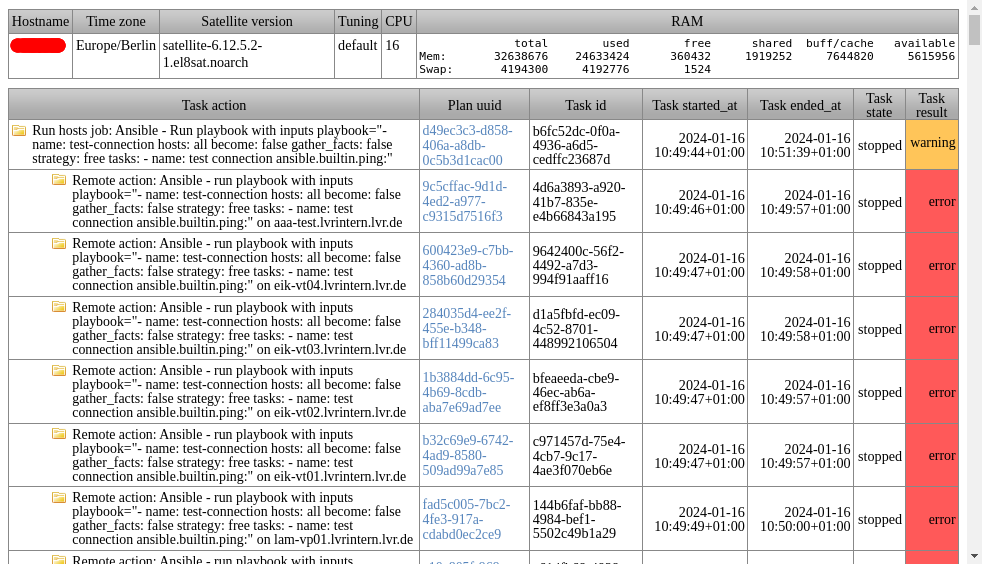
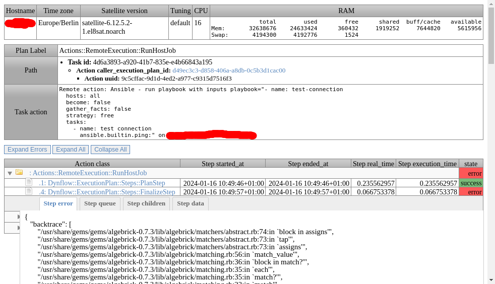
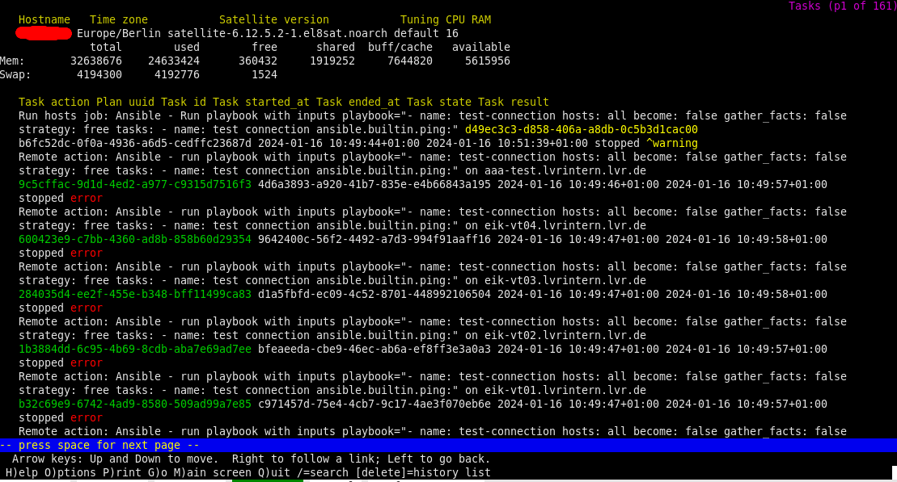

### dynflowparser
Reads the dynflow files from a [sosreport](https://github.com/sosreport/sos) and generates user friendly html pages for Tasks, Plans, Actions and Steps

- Only unsuccessful Tasks are parsed by default. (Use '-a' to parse all).
- Failed Actions & Steps are automatically expanded on the Plan page for easy error location.
- Indented Actions & Steps json fields.
- Useful data on header: Hostname, Timezone, Satellite version, RAM, CPU, Tuning.
- Dynflow UTC dates are automatically converted to honor sosreport timezone according to "/sos_commands/systemd/timedatectl".
- Automatically opens output on default browser.
- Lynx friendly.

| Tasks list | Task detail | Lynx |
| --- | --- | --- |
|  |  |  |

#### Dependencies
Required python libraries:
- python3-dateutil
- python3-jinja2

#### Usage 
~~~
Usage: dynflowparser.py [Options] [INPUTDIR] [OUTPUTDIR]
  Options:
    [-a|--all]: Parse all Plans. By default only unsuccess are parsed.
    [-d|--debug]: Debug level [D,I,W,E]. Default Warning.
    [-h|--help]: Show help.
    [-n|--nosql]: Reuse existent sqlite file. (Useful for self debuging)
    [-q|--quiet]: Quiet. Don't show progress bar.
  Arguments:
    [INPUTDIR]: Default is current path.
    [OUTPUTDIR]: Default is current path plus '/dynflowparser/'.
~~~ 

#### Limitations
- sosreport by default requests last 14 days.
- sosreport truncates output files at 100M, hence some records could be missing.
- Only Dynflow schema version 24 is supported. (v20 is not CSV compliant)

#### How to accurately export tasks.
Included `task-export.sh` can be used to export the required files without the sosreport limitations. Just execute it as follows.
~~~
Usage: task-export.sh DAYS RESULT
  DAYS: Number of days to export.
  RESULT: Filter exported tasks by result: [all cancelled error pending warning].
Example: ./task-export.sh 3 all
~~~

